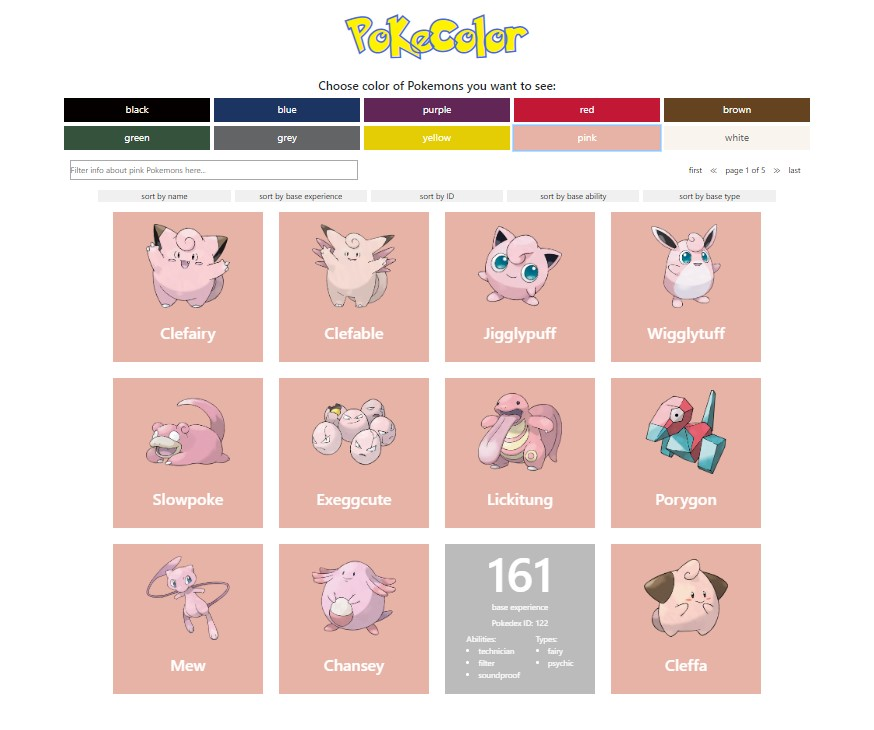

# PokeColor
> 

## Table of contents
* [General info](#general-info)
* [Live demo](#live-demo)
* [Technologies](#technologies)
* [Features](#features)
* [Setup](#setup)
* [Sources](#sources)

## General info
Using data from https://pokeapi.co/ this project gathers information about Pokemons, divided them by colors. Project made as an assignment for summer internship. 

## Live demo 
You can find live demo here: https://sylwiasuwalska.github.io/pokecolor/



## Technologies
Project is created using:
* ReactJS 16.13.1 with Hooks
* React Bootstrap
* axios
* npm
* React Testing Library with JEST

## Features
* display data fetched from APIs
* cards with each Pokemon's image, name, Pokedex ID, base experience,  types, abilities
* sorting by ascending or descending order after click on given buttons, each button has indicators of sort order
* filtering by all fields of table
* responsive layout for comfortable viewing from smaller devices
* pagination
* simple tests
	
## Setup
To run this project, install it locally using npm:

```
# Clone this repository
$ git clone https://github.com/sylwiasuwalska/pokecolor

# Go into the repository directory

# Install dependencies
$ npm install

# Run the app
$ npm start
```

## Sources
* pictures of Pokemons come from https://pokeres.bastionbot.org/
* image of unavailable picture come from https://www.freeiconspng.com/uploads/no-image-icon-15.png
* loading spinner comes from https://loading.io/
* favicon comes from https://pngimg.com/download/27658
